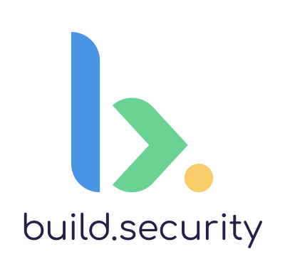
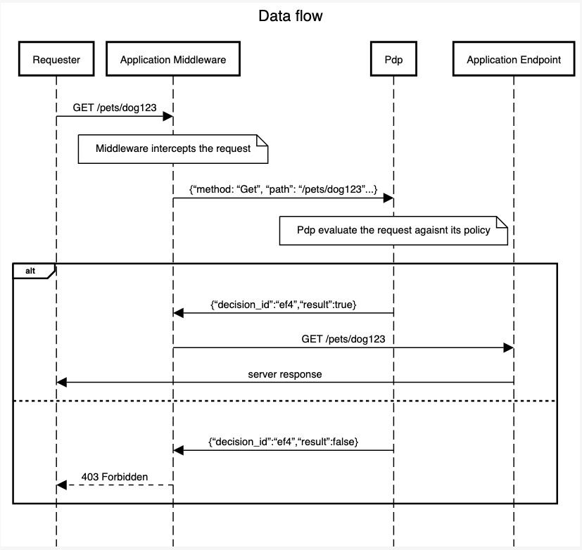

# opa-rails-middleware

<p align="center"></p>

## Abstract
[build.security](https://docs.build.security/) provides simple development and management for your organization's authorization policy.
*opa-rails-middleware* is a Ruby Gem that performs authorization requests against build.security PDPs (Policy Decision Point)/[OPA](https://www.openpolicyagent.org/).

## Data Flow
<p align="center"> </p>

## Usage
Before you start we recommend completing the onboarding tutorial.

---
**Important note**

To simplify the setup process, the following example uses a local [build.security PDP instance](https://docs.build.security/policy-decision-points-pdp/pdp-deployments/standalone-docker-1).
If you are already familiar with how to run your PDP, You can also run a PDP on your environment (Dev/Prod, etc).

In that case, don't forget to change the **hostname** and **port** in your code.

---
### Installation

Install the Gem directly
```
gem install policy_decision_point
```

Or add it to your _Gemfile_
```
gem "policy_decision_point"
```

and run `bundle install`

---
### Simple usage

To intercept and authorize requests being made to your Rails application, add the following line to your `config/application.rb` file, under the `Application` class:

```
    config.middleware.use(PolicyDecisionPoint::PDP)
```

This will initialize the middleware with sensible defaults. To initialize it with different configuration values:

```
    config.middleware.use(PolicyDecisionPoint::PDP, port: 7171, policy_path: 'mypolicy/allow')
```

This will initialize the middleware and tell it that the PDP server is bound to port `7171` instead of the default `8181`, and that the rule that decides whether to authorize requests is `allow` in the policy package `mypolicy`.

You can see how this is done [in the example](/example/config/application.rb).
   
 ### Configuration

 1. `hostname` - The hostname of the Policy Decision Point (PDP) **Default is localhost**
 2. `port` - The port at which the PDP service is serving authz decisions **Default is 8181**
 3. `policy_path` - Full path to the policy (including the rule) that decides whether requests should be authorized **Default is /authz/allow**
 4. `retry_max_attempts` - the maximum number of retry attempts in case a failure occurs. **Default is 2**.
 5. `read_timeout_milliseconds` - Read timeout for requests in milliseconds. **Default is 5000**
 6. `connection_timeout_milliseconds` - Connection timeout in milliseconds. **Default is 5000**
 7. `retry_backoff_milliseconds` - The number of milliseconds to wait between two consecutive retry attempts. **Default is 250**

[How to get your pdp's hostname and port?](https://docs.build.security/policy-decision-points-pdp#pdp-instances-section)

### PDP request/response example

This is what the input received by the PDP looks like.

Note that the headers are normalized by Rack/Rails: they are uppercase, use underscores, and have prefixes.

```
{
  "request": {
    "headers": {
      "CONTENT_LENGTH": "7",
      "CONTENT_TYPE": "application/protobuf",
      "HTTP_ACCEPT": "*/*",
      "HTTP_ACCEPT_ENCODING": "gzip;q=1.0,deflate;q=0.6,identity;q=0.3",
      "HTTP_HOST": "9.9.9.9:1234",
      "HTTP_IF_MODIFIED_SINCE": "",
      "HTTP_IF_NONE_MATCH": "",
      "HTTP_USER_AGENT": "Faraday v1.4.3",
      "HTTP_VERSION": "HTTP/1.1"
    },
    "method": "POST",
    "path": "/twirp/example.hello_world.HelloWorld/Hello",
    "query": {
        "key": "value"
    },
    "scheme": "http"
  },
  "source": {
    "ipAddress": "8.8.8.8",
    "port": 1234
  },
  "destination": {
    "ipAddress": "9.9.9.9",
    "port": 1234
  },
}
```

If everything works well the middleware receives the following response from the PDP.

```
{
    "decision_id":"ef414180-05bd-4817-9634-7d1537d5a657",
    "result":true
}
```